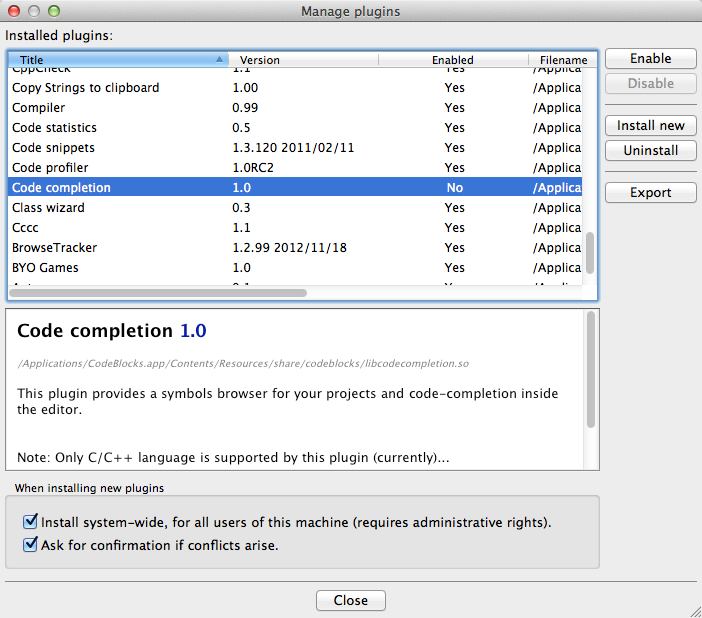

..  _installing-codeblocks:

##############################
Installing Code::Blocks on Mac
##############################

..  include::   /references.inc

..  warning::

    Code::Blocks is fragile on the Mac, especially under Mountain Lion (the
    latest release). It crashes a lot, but can be used if necessary. If this
    bothers you, I will add notes soon to show how to work outside of the IDE.
    That will be an easier way to work!

These days, I have quite a few students in my classes who only own Mac laptops,
I feel it is important that we provide the tools needed to complete my classes.
At least as much as possible. Occasionally, we use tools that only work on the
PC platform.  In those cases, it is possible to set up a virtual machine
(software that pretends to be a real computer, and does it well enough to
install Windows) or by having the students use Boot-Camp to install Windows and
Mac software. 

This note will cover installing a development environment suitable for the
beginning courses in C++ programming we offer at ACC_. In those courses, we
normally install `Dev-C++`_, but that program is Windows only. The best
alternative to that package is `Code::Blocks`_ which runs on all major platforms.

..  note::

    I am campaigning to replace `Dev-C++`_ with `Code::Blocks`_ in all classes, but
    that has yet to be approved.

********************
Downloading the code
********************

The project website has links to install this software on all major platforms.
We are interested in installing the package on Mac OS-X. The link needed for
that version is here:

* `Mac OS X Code::Blocks
  <http://sourceforge.net/projects/codeblocks/files/Binaries/12.11/MacOS/codeblocks-12.11-mac.dmg>`_

This link downloads a normal Mac ``.dmg`` file, which you install by locating
the download using the ``Finder`` tool, then double-clicking on the file name:

Click on "OK" and the file will end up in your ``Downloads`` directory.

**********************
Installing the program
**********************

Now, fire up ``Finder`` and locate the file:

Double click the file name and you should see this:

Installing this is as simple as dragging the ``CodeBlocks.app`` file into the
``Applications`` directory on your Mac. You can do this with the ``Finder
tool``. Click and hold the mouse on the filename, then drag it until the
``Applications`` directory highlights. Let go and you should see the program in
your applications list. 

****************************
Add the program to your Dock
****************************

The first time you launch the `Code::Blocks`_ application, right-click on the
icon in the dock area at the bottom of your screen. You should see an entry
under "Options" to "Keep in Dock". Click on that, and you will be able to
launch the program from the dock easily.

Here is what you see as the program loads:

This is normal, just click on "OK"

Next, you will see this:

Finally, you discover you have a problem:

Unfortunately, the compiler is not included with the package you just
installed. On Mac, you must install two components in addition to
`Code::Blocks`_. Those components are:

* Xcode - you install this from the Apple Mac App Store. You need an Apple ID
  to do this, but you need that for just about everything, so you should have
  set it up!

* Command Line Tools for Xcode - these get installed after you install Xcode.

*************************
Getting a compiler on Mac
*************************

The standard compiler tool set for Mac comes as part of the ``Xcode`` package
Apple provides to developers. They used to charge real money for this tool, now
it is free!

Download Xcode
==============

Open up the Apple Mac App Store app and search for Xcode:

..  image:: CodeBlocks8.png
    :align: center
    :width: 600

Click on the ``install`` button on the Xcode icon. This is a free download, but
it is big and will take a while to install.

Installing Xcode
================

Follow the same procedure you used to install `Code::Blocks`_ to install
``Xcode``. Once it is installed, start it up from the ``Finder``. (You will not
need this tool on your Dock!

Once you have finished installing the tools, you should see this entry in your ``Applications`` directory:

And, here is what you should see as you start up Xcode for the first time:

Installing Command Line Tools
=============================

Apple did not make it obvious how to add the next component. You get to this one by doing this:

Click on :menuselection:`Xcode --> Preferences --> Downloads --> Components --> Command Line Tools` (Phew)

Click on the menu selection to install it, and wait while that happens. You should eventually see this:

Now for the hard part
=====================

SO far, every time I wake the program up, it complains about the compiler. I see this:

I will figure out how to stop this and update the notes. For now, just select the Gnu C/C++ compiler option and continue.

Now, we have to fix a problem:

It appears that a ``plugin`` called "Code Completion" is causing all kinds of
problems for the developers (most of whom are PC people with no Mac
experience!). The system can be made stable enough to use if you wake it up
(perhaps selecting the compiler again, at least until I figure out how to get
it to stop complaining). Then do this:

( Navigate to :menuselection:`Puugins --> Manage Plugins`. You should see this:

Click on on the entry for ``Code Completion`` (scroll down, it is there) then
click on ``Disable``. After the menu shows that it is disabled, click on
``Close``. At this point, you should be able to build a program, and run it.
The process is essentially the same as when using Dev-C++. Just search around
the menu system to see where things are. For instance, instead of "Executing" a
program, we "Build" it. Hmmm, perhaps there is more to that Bloodshed company
name than we suspect!).

..  warning::

    When you create projects using `Code::Blocks`_, or create file with any
    program, be sure you are in control of where things end up. Create a
    directory (folder) for your project and save all project files in that
    place. You will be glad you did when you later want to review something
    that worked as you try to get a new project going.

..  note::

    If you have problems with this program crashing, let me know. We might need
    to review your setup in the lab (hopefully, you are using a Mac laptop!)
