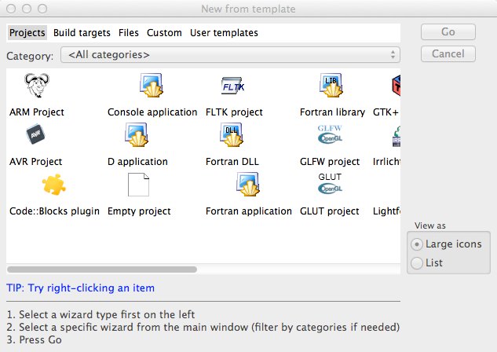

..  _mac-glut:

###########################
Glut in Code::Blocks on Mac
###########################

..  include:: /references.inc

If you are using a Mac for this course, you are probably using `Code::Blocks`_.
As installed, `Code::Blocks`_ is ready to run Glut graphics programs. You do
not need to install anything else. However, the code you need to set up is
slightly different.

***********************
Starting a Glut project
***********************

`Code::Blocks`_ uses the project concept to keep all your program files together
in a single place. As usual, you should create a directory (folder for PC
folks) for each project you create.

In Code::Blocks, click on :menuselection:`File --> New --> Project``

Note the "Glut Project" entry. Click on that to create the startup project.

You should compile this code to make sure everything works properly before
creating your new program.  Th code produces the same image we saw in the PC
version of Glut.

********************
Setting up your code
********************

Here is the basic Graphics program. Note the new stuff at the top of this file.
These few lines check to see if the program is running on an Apple system, and
includes the ``Glut.h`` from the place the file lives in on Mac systems. If you
leave this chunk of code out, the program will not compile.

..  code-block:: c

    #ifdef __APPLE__
    #include <GLUT/glut.h> 
    #else 
    #include <GL/glut.h> 
    #endif

    #include "Graphics.h"

    void drawScene(void) {
        // your code goes here
    }

    int main(int argc, char ** argv) {
        GraphicsSetup(argc, argv);
        glutDisplayFunc(drawScene);
        glutMainLoop();
    }

You should be able to follow the notes to create the demo graphics program for
the class. Then off to the next lab!
