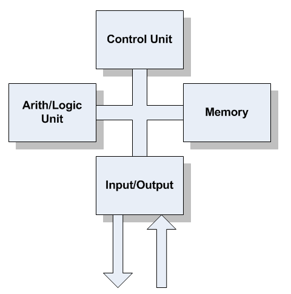
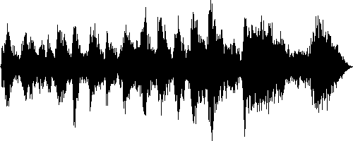
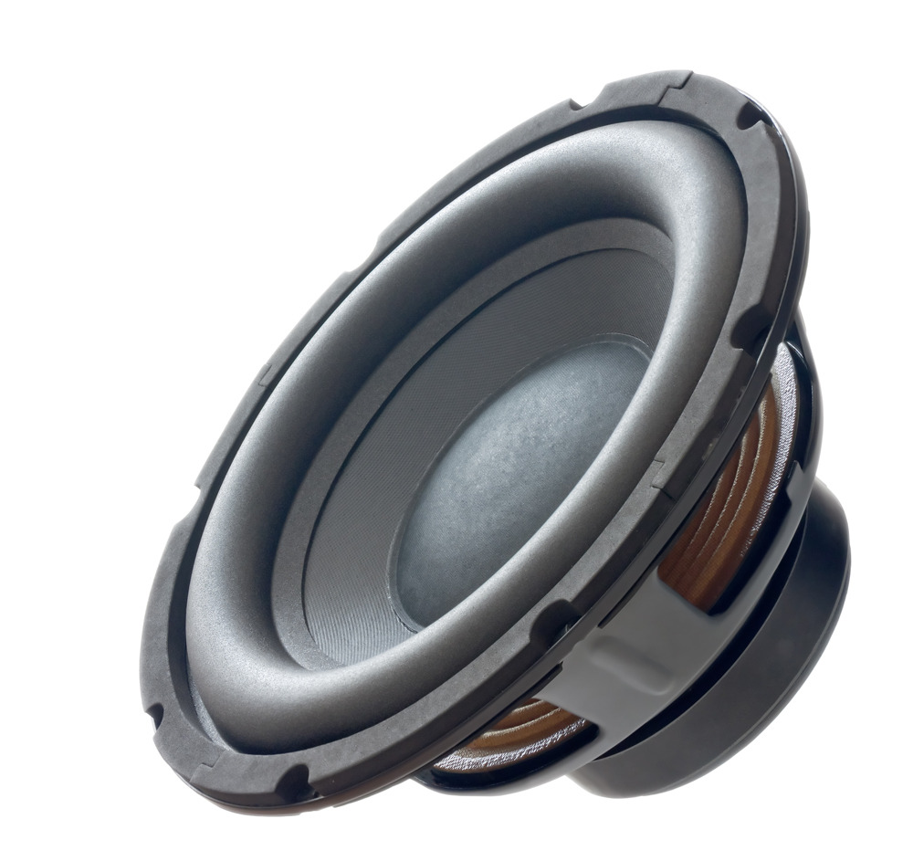

..  _von-neumann-machine:

The Von Neumann Machine
#######################

John Von Neumann was an important figure in the history of computing.

..  image:: JohnVonNeumann.jpg
    :align: center

His contributions to that history really began when he authored this document
in 1945:

    :download:`FirstDraft.pdf`

World War II
************

Back in 1945 -- World War II was still going on -- John Von Neumann was
thinking about the whole business of computing. He published his paper as part
of work to build an electronic computing machine, and started the world on a
whole new track.

Von Neumann explained to the world (in 1945) how an electrical device with a
``Stored Program`` could process information. Although he did not come up with
these ideas alone (he was working with a team of scientists and engineers
building this first machine), Von Neumann was the first to write everything down
in a way that was clear and easy to understand. We call the architecture he
described, a "Von Neumann Architecture" but major features of the architecture
should be properly attributed to others, like Eckert and Mauchly who built the
first stored program machine at the University of Pennsylvania in 1943 (ENIAC).
Today, Alan Turing (whose story was told in the popular movie, *Imitation
Game*) is credited with having come up with some of the basic principles that
led to the development of the computer as well. 

Von Neumann's  computing mechanism consisted of four fundamental parts: 

* A *Central Arithmetic Unit* (CA) to do the number crunching 
* A *Control Unit* (CU) to manage the machine
* A *Memory Unit* (M) to store programs and data
* An *Input/Output Unit* (IO) to get things into and out of the machine

How the parts are organized
***************************

As obvious as this might seem today, back when Von Neumann was doing his work,
few people really had any idea what an automatic calculating device should look
like, so this paper was hugely important to those people who set out to build
one. The first machines to come out were huge, used immense amounts of
electricity, broke often, but they worked!

A computer is really just a fancy electronic device that does very simple
things. There is nothing magic about this. A human could act as the Control
Unit, a piece of paper could function as the Memory, a calculator as the
Central Arithmetic Unit, and the keys and display of the calculator as the
Input/Output device. 

To this day, most computers follow this basic architecture. This course focuses
on creating programs for the most fundamental part of the modern computer - the
*Control Unit*, or the *Central Processor Unit (CPU)*. In today's computer
systems, the control unit and the arithmetic-logic-unit are packaged in a
single integrated circuit. We will concentrate on one of the most popular of
these chips - the CPU of most IBM-PC class of computers.  Specifically, we will
look at the Intel Pentium processor, and later at two much different chips - called
microcontrollers.

Von Neumann's Machine
*********************

The first electronic computing machine was actually constructed in England. It
was called EDVAC. The first such machine in the US was Eniac, built at Penn
State. There is some debate, even today, over which machine came first, but Von
Neumann's place in history was assured by his paper, which was widely circulated
and became a handbook for further development of electronic computers.

..  figure:: edvac.jpg
    :align: center

    EDVAC

This beast weighed in in tons, and was huge in all its glory. It was also
fragile! About 300 of the tubes in this thing burned out each day and had to be
replaced!

Computers Today
***************

The basic hardware you find today, in a modern computer, still fit into one of
Von Neumann's basic structure:

Memory
======

We actually have several kinds of memory in a modern system

Internal Memory
---------------

This is also called *RAM* (Random Access Memory). This is where data are kept
(and program code) while a computer works. 

You want lots of this so you do not forget stuff, right? Actually, the primary
memory in your computer forgets everything when the power goes away, so we need
another place to store things between times when we process it. We use *disk
drives*, and other devices like then, to do that.

External Memory
---------------

There are several kinds of storage devices around these days, all designed to
store programs and data between (or even while) a program runs:

    * Hard Disk Drives (big and reasonable cheap, much slower than memory)

    * Solid-State Drives (not so big, expensive, and much faster than disk drives)

    * Flash Drives (USB Thumb Drives, cheap and easy to lose!)

    * DVD Drives (normally only for input, or movies/music)

All of these devices connect to the machine through the input/output component.

Control and Math
================

The heart of the modern machine lives in a single integrated circuit, that packs
all 19,000 of those tubes in Edvac into a package about a half-inch square.
(Actually, the modern chip has over a billion switches in it - Wow!) Amazing!

What is in that chip is everything needed to pull data in from external
storage, move it around in memory, and transform data according to the
instructions YOU provide.

They actually are simple devices. What happens inside that chip is pretty
amazing. I teach an entire course on just that topic (COSC2325 - Computer
Organization and Machine Language). It is a pretty cool course!

Input/Output
============

There are tons of other gadgets we can attach to a computer. All of these hook
up to the computer either on an input connection, or an output connection
(sometimes both).

For our work, the most important input device will be the keyboard. Using that
you will be able to enter certain kinds of data. For the most part, that will
be limited to numbers, letters, and short words. The program you write will
convert the actual keys you type into those data items for you. (How is a more
advanced course). 

The most common output device we will use is your screen. We will make a few
graphical things happen in this course, but often the output is just more
numbers and words printed across the screen in a simple (boring) window called
a "console". That term dates back to the 1960s. Before that computers printed
output on paper. Boy, did we kill a lot of trees when computing first started!)

Input and Output devices are the primary way we move from the human world to
the computer's internal world. The computer actually understands nothing about
our world. It is up to us to figure out a way to transform anything in our
world into something the computer can process.

As an example of that, let's consider music. 

Computing with Music
--------------------

The computer cannot hear anything, but we have invented devices that react to
sound. We call those things microphones. 

..  image:: microphone.png
    :align: center
    :width: 500

When a microphone hears a particular sound it converts that into a varying
signal (called an analog signal) that represents the sound it heard.

That pile of wiggles is just a plot of the tones in the sound as they change
over time. If we "sample" that signal really fast, we can convert it into a
sequence of numbers. Each number represents the "tone" in that signal at that
one tiny instant in time. If we were to play back that tone (over an output
gadget called a "speaker"), our ear would hear the same tone.

Computers just do all of this so fast, your ear is unaware that it all got
transformed in some cool ways. Since that music was converted into a bunch of
numbers, it is easy to process the music and do cool things with it, like
adjust all the tones, or "filter" out some tones we do not want to hear. (I
wish I had a really good filter I could use any time I see a politician on TV -
HA!)

Creatively thinking about things in our world has led to all kinds of
interesting input and output devices. In my classes, we play with robotic
devices that can make things move, detect motion, figure out how bright the
light is in the area, or read a GPS signal from a satellite to see where we
are. 

Even 10 years ago, a lot of this was unthinkable, Shoot, I bet those folks
traveling around the globe on sail driven ships would just about faint at the
idea of GPS to help them figure out where they are. Of course, before Columbus,
the idea of a satellite would bring up thoughts of demons, I bet! Today, many
folks listen to "Mrs. Garmin" to get instructions as they drive around hunting
down some restaurant!)

