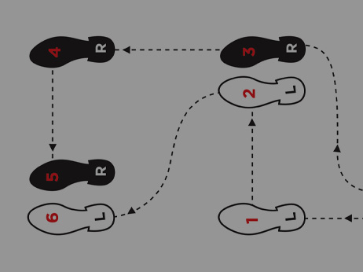
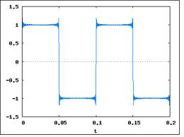

..  _texas-two-step:

Texas Two-Stepping
##################

..  include::   /references.inc

..  seealso::   Text, section 1.4

We live in Texas, so you all know how to `two-step`, right? I am not a native
Texan, so I do not actually ever do the `two step`, but I have danced a time or
two - usually at weddings. As humans, we all have some sense of rhythm.
(Actually that may not be true, some folks cannot keep a beat to save their
souls. We will ignore that fact.)

Keeping the beat
****************

In order to dance, we need to have a sense of the `beat`. What is that anyway?
It probably dates back to when ancient humans pounding on trees with a stick.
Eventually they moved from the tree to a hollow tube with some form of skin
stretched across it - what we call a drum today. That is one way to keep the
beat, pound on a drum.

Another way might involve switching a light on and off. Just go stand in the
front of the room and flip the switch in a pattern. The humans in the room will
learn to track the on and off sequence and that forms a `beat` of a sort. Hmmm.

Moving with the beat
********************

Once we have a `beat` to work with, we can start moving to the `beat`. Dancing
involves moving through a sequence of basic steps in time to the `beat`. Here
is the two-step:

When you learn how to dance, you find yourself counting steps:

* "1,2,1,2,3,1,2,1,2,3,1,2,1,2,3"

You do something different on each count, and you do this over and over. Real
dancing involves adjusting how you move a bit so you do not crash into the
walls, but you basically keep on doing that basic thing until the music stops. 

..  note::

    Yeah, I know "real" dancers do a lot more than that, but you get the
    picture!

What does all this have to do with computers?
*********************************************

A long time ago, it occurred to people wanting to build machines that could
"crunch" numbers, that about everything humans do could be reduced to a pattern
similar to dancing. We learn a simple sequence of steps, and do them in time to
the "music". Hmmm, is that really true. Let's see! How do I start a car:

1. Get out the car keys
2. Open the car door
3. Sit in the driver's seat
4. Put the keys in the ignition
5. Turn the key until the engine starts

I do this automatically every time I walk up to my car, and I do not even think
about it. But the pattern is there, I just usually do not have any music to use
to keep the beat. I still do it in about the same amount of time - practice
makes perfect!

Can a machine do this?
======================

It turns out to be pretty easy to build an electronic circuit that can keep a
beat. We create electronic gizmos that operate at some :term:`voltage`, like
110 volts for things you plug into the wall, or 3 volts for toys you give to a
kid. Computers tend to run at 5 volts, so we build a simple circuit that can
toggle between 0 volts and 5 volts in a simple pattern. It works just like you
going up to the wall and flipping a light switch on and off in time to real
music!

If I hook up a special device called an oscilloscope which shows me the voltage
in a circuit over time, I might see this:

When the line is high, the voltage is 5 volts, when it is low, the voltage is
zero volts.

..  note::

    If you know nothing about electronics, think of voltage like water
    pressure. The higher the pressure (voltage) the more electrons we can move
    through a pipe (wire). Unfortunately, higher voltages can hurt you. Come to
    think of it, do not stand in front of a fire hose for the same reason!

Notice the funny stuff around the corners where the voltage changes. Real
electronic signals do this kind of thing and it makes designing electronic
gadgets hard. We will ignore that for this course. Someone already handled that
stuff when they built the computers.

The computer clock
==================

Computers are simple devices that have an internal "beat" kept by a signal of
this kind. We call the device that generates this signal the `system
clock`. All the stuff inside the computer does work in time to the beat of this
clock. Now, as a human trying to generate the beat for a bunch of dancers, you
could get cute and speed up the signal by flipping the light switch on and off
faster. It might be fun to watch folks try to dance in time to the beat as this
happened, but eventually people would fall down and come after you, so don't do
that!

Now computers do not really care about the signal going faster. They will just
work faster. There is some upper bound on how fast you can flip the clock, but
that is something involving how fast electrons move through wire.
Unfortunately, as we try to make the computer work faster another problem comes
up - it gets HOT. So we end up compromising and run the clock at some insanely
high speed, like 2.6 billion "ticks" per second. Yikes!

*****************************
Does a computer really dance?
*****************************

Of course not! Really? Well I think it does, but it does so in a little
different way.

Pretend you have a bunch of cards in your hand when the music starts. Each card
shows you what you are to do during one small set of "steps" (Like those shown
in the two-step diagram above). What you will do now, is pick a card off the
top of the deck and when the music starts do exactly the sequence of steps on
that card.  When you run out, pick up the next card and work through those
steps. I have no idea what this will look like, but it sounds kind of cool.
Let's see one chunk of two-step, followed by one chunk of waltz, followed by
one chunk of rumba. Man that will be wild to see. (Dancing with the crazy
stars, anyone?)

Now, let's call each card an instruction, and the sequence of individual moves
on that card we will call a "micro-instruction"

Guess what! You are looking at exactly what the Pentium processor does in your
PC as it runs. Each "instruction" is a task (trick) the Pentium knows how to
do. The "micro-instructions" guide the internal components of the processor in
doing that task. As a programmer, you need to assemble a sequence of
"instructions" to cause a higher-level task to happen. Our crazy dancers might
need to move around the room in a square pattern. You stack up cards that cause
that to happen. Obviously, you need to know what each card makes the dancer do,
and what that means in terms of moving them across the floor. Once you know
that, you could stack up a set of cards that makes them move as you wish. Cool,
that is what programmers do!

************************
Programming sounds hard!
************************

It is not exactly hard, but it requires a level of attention to detail that is
hard to do when you start. If you stack the cards wrong, the dancers crash into
the walls. Not good! We deal with these problems, by improving our
understanding of how the instructions work, and we try a different arrangement
of the cards. Sooner or later, we end up with something that works as we want. 

You can learn this
==================

Think about it. In your day to day life, you know how to do tons of things.
Each one of those things you had to learn how to do. You practiced until you
did not even think about it, you just do the task and move on. Eventually,
programming will get like that. You will know what each construct does, and you
will stack them together in the right order and - boom - magic happens, the
computer does your bidding.

I do not know why this fascinated me so much when I first started programming,
but it changed my life! 

***************
What comes next
***************

OK, we have a basic idea about how computers work, and what programs are. This
is only the start. We will try to build up your internal image of what is
happening as you create these program things!

I am a visual kind of person. I grew up very much into art as much as
engineering, and it helps me to visualize things I do in the computer world.
You work in a different way. I hope examples like this will help you construct
your own internal picture of that is going on in your programs. Let me know if
you have better ideas for something that works for you!

