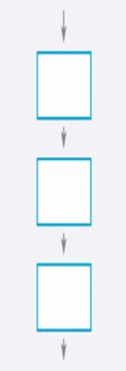
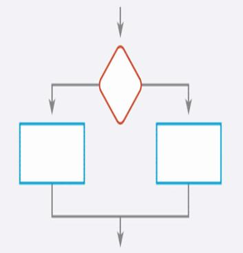
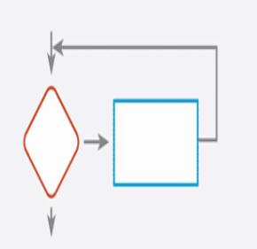

..  _input-process-output:

Input - Process - Output
########################

..  include::   /references.inc

At the heart of all computer programming is a simple mantra:

    * `Input` some raw `data` from the human world

    * Have the computer manipulate that `data` according to a set of instructions
      called a `program`. We call this manipulation `processing`.

    * `Output` the results to the human world.

Most folks call processed data `information`. Information has a higher value to
the user of the program. However, one person's `information` may be another
person's `data`. 

Designing a Program
*******************

We need to start our learning process somewhere, so let's start off by looking
at the process we will use to solve any problem using a computer.

..  note::

    Clearly, there will be some problems where using the computer is just not
    going to happen. That is just fine. What you will learn in this course is
    not really about computer programming, it is about solving problems that
    happen to involve computers. The techniques you study apply to all kinds of
    problems, and your concerns are almost the same regardless of the kind of
    tools you ultimately use to solve your problem. 
    
We solve problem using computers by designing programs that make the computer
do the required work. Programs are not just hacked together by a bunch of
people pounding on a keyboard. At least programs that have real value are not
built that way. Most professionals will tell you that the actual keyboard work
is a small part of what they do. Well, that is, the keyboard work that involves
entering program code is a small part of their keyboard work.

I have seen studies that claim that over 80 percent of the work you do as a
programmer is all in your head. You are thinking about the problem you want to
solve, studying how to solve it, how to test it, how to organize it, and how to
document it. You are also very concerned with making sure the client who
wants your program is getting exactly what they need! 

All of that is hard work, and some will say it is no fun. But, I discovered
that it can be fun, and can lead to a very rewarding career. .

A Thinking Tool
***************

We need a tool to help us learn how to think first, then we will translate that
thinking into real code later. The book uses a tool called a `flow chart` which
dates back to the early days of programming. `Flow Charts` are simple to draw,
but they are a pain to build in real life without the aid of a program to help
lay things out. We will not worry about drawing flow charts for our work, but
it will help to look at them and use them to understand how your program will
`flow`. Basically that means how the computer will work through the lines of
code you will write ultimately.

To get started, I am going to use Scratch_ as a simple aid to help you form
your early programs. Scratch_ is a sort of flow charting tool, although it does
not use the same symbols as your text. I think you will find it easy to sue and
fun to boot Shoot, kids have a ball playing with Scratch!

Running your Design
===================

What makes Scratch_ a powerful tool is its ability to let you drag programming
constructs onto your design screen, then run the program easily to see how it
works. We will not do much number crunching with Scratch_, but we will do some
animations and a bit of drawing.

A tool like Scratch_ is not really needed to think through a solution to a problem.
But it is fun to use, and some people are more "visual" than others. To them a
picture showing how we "flow" through the steps in our solution helps them
think about if it will really work or not.

Actual program design
*********************

In this part of our learning, we can use nothing more complicated than a piece
of paper and a pencil. (OK, fine! We probably will use a computer to write our
thoughts down, That will make changing our mind and rearranging out thoughts
easier and less messy, than if we had to erase and rewrite things!)

Most of the actual program design process involves thinking about your problem.
So, warm up your brain, and we will start learning how to use it effectively.

We will start off this thinking process by thinking about it! (This sounds hard!
Don't worry, it is not, and you do it all the time without thinking about it -
HUH?) What I mean is that this is what you are doing when you figure things out
as a normal human!  There is no magic here, just common sense! You know when
something makes sense, you know if it sounds like it will work. We will be
doing the same thing here. We will write down our instructions on what to do to
solve a problem, then we will study those thoughts and convince ourselves that
this will really work!

Perhaps while we are studying our current thoughts, it will occur to use that
we could explain things more clearly. This realization is vital to the process
we are going to use. This computer thing is really dumb. It will not fill in
any blanks we leave out. While humans might be able to do that, the computer
will never do that.  So as you think your problem through, remember that you
need to explain it to this really dumb critter called a computer. In doing so,
there is little chance that any intelligent human will not understand what you
mean!

Problem statement
=================

We will start off with some kind of `problem statement`. This statement will
have been written by some poor human who needs help. The statement itself,
might not be so clear, but we have to start somewhere, and this is it! As we
try to solve our given problem, we might need to go back to whoever gave us
this problem, and fill in a few details later. That is an essential part of
making sure we solve the right problem. You are never to assume you know what
is meant in the problem statement. You need to let the owner of the problem
tell you, you might assume wrongly! The owner lives in the world where the
problem came from, as a programmer, you might not live in that same world, and
might not understand the terminology.

Breaking the Statement Apart
----------------------------

Our first job is to study the statement and see if we can figure out what data
we need to collect to get the solution started. All programs need to process
something and produce something. This step is focused on the something we want
to process. We call that something the `program inputs`. 

Next, we need to figure out what we are supposed to produce. The whole point of
this problem solving stuff is to figure out how to produce the required
`program outputs`. In some cases there may be no tangible output. Instead
the computer may just run some equipment a certain way. You can argue that the
signals used to control that equipment are outputs, and you are right. We will
just not be printing those signals out so us humans can read them!

Find a Solution
---------------

The last part is the toughest. Figuring out what to do to convert the input
stuff into the output stuff. We call this step "Processing". The entire process
cam be boiled down into that simple operation we mentioned at the beginning of
this discussion::

    INPUT --> PROCESS --> OUTPUT (IPO)

Input a bunch of input data, process that data to produce something new, then
output the new stuff and you are done! Simple, right? Well doing this well
takes practice, and we will practice that a lot in this course!

In your homework problem for last week, you were to think about a process
that will calculate the square root of some number. While this seems silly to
those of us who know how to do that, just pull out the calculator and punch a
few keys, this kind of problem consumed the mathematicians of the day back when
there were no computers, or even calculators. All they could do was work up a
totally manual process that someone could follow to come up with the required
answer. As you try to solve the problem, yourself, you are going to get
frustrated, because with no guidance, you may not even see a way to get
started! Hopefully, after reading through all of this lecture, you will be able
to get started, and perhaps even come up with the solution.

In your square-root problem, the input is easy to see, it is just a simple
number.  The output is also easy, another number. The conversion (processing)
is not so easy. In other problems, it may not be so easy to spot the input
data, but we have to do that to get started. We also have to explicitly figure
out what we are supposed to produce in order to claim that we really have
solved the problem. That process step in the middle is where all the real work
in designing the solution can be found.

An Example Solution
-------------------

By the way, here is a solution to that homework for you to think through. See
if you agree it can do the job. If it has holes that you can spot, good for
you! There are a few issues with the solution presented.

    * :ref:`square-root-solution`

Thinking it through
===================

What we need to do is to learn how to use a new toolbox to solve problems. We
will actually only have a few basic tools in this toolbox. Our first job is to
understand how each one of these new tools works, and learn how to figure out
when to use each one. The basic ideas are simple, and it takes practice
attacking small problems before you will be able to tackle hard problems.

The basic tools are these: the sequence, the decision, and the loop! 

..  note::

    No fair inventing a new "left-handed-isostatic-framismeter" to put in your
    toolbox. (That was something my friends and I thought up in a hobby store I
    worked in as a teenager. The thing was designed to confuse people. It was
    made up from junk parts we found in the shop bolted together into a strange
    mess! All of us in the shop acted like it was the coolest tool around, just
    to watch the faces of the people around us who just knew we were nuts! We
    will only use the simple tools we are given to make sure we do NOT confuse
    people, especially ourselves!

We will only use these three simple tools. Unlike real toolkits with things
like hammers and saws, these tools are things we have an infinite supply of.
You pick one out of the toolbox, and stick it in a list of steps in our
solution. What we are trying to learn is how to decide what too to grab and
stick in our solution list.:

The Sequence tool
-----------------

When we study a problem, we often see a way to break the big problem down into
a set of smaller problems. If we line up the set, we see that a sequence of
steps will do the job. If these steps depend on each other, we must do them in
a particular order. If they are not interrelated, we might do all the steps at
the same time, given the right hardware. This kind of thinking leads to
parallel processing programs. Much to my dismay, we do not study parallel
programming here, in spite of the fact that the modern computer really can do
more than one thing at a time, and we should be learning how to think that way!

In breaking problems down, we run into our first opportunity to name something.
We do this all the time in programming. We name containers that will hold our
data (something we call `variables`, and we also name blocks of code we will
figure out in detail later. That "INPUT" block above is such a block.
Eventually we need to figure out exactly what we need to input and where we
will put that data while we process it later. 

Names are important, since they convey meaning to the reader. A name like `X24`
is not very useful, but one like `InputData` helps us understand what is going
on. We will go over rules for naming things later. For now, any name will do,
but try to make your thinking clear in what you write, and keep names
reasonably short. (Usually, we never put spaces in names we come up with.
Instead us an underscore between words, or just mash them together as shown in
the example.)

The `sequence` tool is our first major step in `decomposing` a big problem into
a set of smaller, hopefully easier to figure out, sub-problems.

Here is a simple diagram showing how things "flow:

The Decision tool
-----------------

You will determine that you have reached a point in your code where what you do
next depends on what has happened just before this point. You will have done
some calculations, and you must ask a question about some aspect of your code
and the data it manipulated to figure out what to do next. Depending on the
answer to your question, you will process one set of instructions, or another
set. This is called an IF-THEN-ELSE tool.

..  note::

    We do allow the "then" part of this tool to be empty. That means you only do
    something if the answer to your question is "true". Otherwise, you skip
    that something and continue on after that to the next tool. This is the "IF-THEN'
    rather than the "IF-THEN-ELSE" tool.

Here is a simple diagram how a "decision" works:

The loop tool
-------------

This tool has a pretty obvious application. You have something to do over and
over. We call this kind of thing a loop. It will usually be obvious that you
need a loop, so you stick one in your design. You will need to also figure out
how to stop the loop!

However, in some problems, you might not see that you need a loop. Is one
needed to figure out the square root of a number? On first thinking about it,
you probably do not see a loop in there anywhere. What those old mathematicians
figured out, though, was that they could come up with a scheme that guesses at
an answer, figured out how far off they were, adjusted the guess and tried
again, and so on. Guess what, there is a loop sitting there! There is also an
interesting way to stop it (when you get close enough to the answer you want
that you are satisfied!

Finally, here is a simple diagram showing how the basic loop "flows":

That is it (for now). We will use just these three tools and try to carve our
problem up into small pieces where one of these tools can be applied as we work
towards a solution! We will take steps in our solution by adding one tool at a
time to a list of tools we will create. The solution will involve using each
tool, the way it is designed to be used, then use the next one and so on. When
we reach the end of our list, the problem will have been solved.

Baby steps
**********

I am a strong believer in taking small steps as you work through a design. You
carve off a chunk of the problem that you think you can work out, then go back
and carve off another one. One thing you need to do as you work through this
process is to stop and "walk through" your design, asking yourself if this will
really work. As you get better at this, it will become easier. Taking small
steps is better than fighting with a big problem for hours. Take a small step,
then look for another small step. Eventually you will end up with a full
solution.

Testing
=======

As you work, you should ask yourself how to tell if things are going well, or
how to tell if things are going wrong. We really want to write two things. The
program itself, and a set of tests that give us confidence in this new tool we
are creating.

None of this comes easily at  first. Some folks are better than others at
finding chunks to carve off and work. The more you practice, the better you
will get at all this problem solving stuff.

Tools like Scratch_ give you a visual tool to create a diagram that you can sit back and
study.  Only when you feel that this will really work should you convert your
diagram to code and try it out. (With Scratch__ we can try things out whenever we
like!) Hopefully, in your thinking about testing things, you came up with By
then, you should have an idea how to see if this is really doing what your
want.

The classic old saying
**********************

One rule programmers learn early is this::

    Plan on throwing one solution away, you will anyway!

What this means is that your first try at solving a problem (or your second, or
third) may not be that great. Maybe you should start over, using what you just
learned to build a better solution the next time. When I wrote the program I
used for my Master's Degree at Texas State, I used the fourth version that I
wrote. I rewrote it three times before I was satisfied with it and it ran with
little problems for over four months with about 150 students pounding on it 24
hours a day!.

Do not fall in love with your work to the point where you hold on to it beyond
where you should have started over and done it better.

Pseudo Code
***********

Many programmers use something called `pseudo-code` rather than drawing
diagrams. These are easy to create using a simple text editor. Basically, we
use simple sentences that express what we want to do, without worrying about a
bunch of rules telling us EXACTLY how to write things. We sprinkle some special
words aound so we can see out structures constructs. Here is an example:

..  code-block:: text

    START
        set "sum" to zero
        set total to zero
        LOOP
            read a number from the user
            IF number is zero
                stop the loop
            END IF
            Add that number to "sum"
            add one to "total"
        END LOOP
        set "average" to the value you get when you divide "sum" by "total"
    STOP

..  note::

    There are no rules telling you how to do this. The idea is to get your
    thoughts written down so you can study them and convince ourself that this
    "solution" will get you the answer you want!

A problem to solve
******************

Let's try to solve a simple problem, not by programming it, but by thinking it
through using the "pseudo code" stuff. The problem is fairly simple - balancing
your checkbook. But this bank is mean. For every check you write, they are
going to charge you a 10% fee (Boy, I want out of this bank as soon as I can
move my money!).

We will assume we start off our balancing session with some bank balance and a
stack of checks and deposits we made during the month. We probably got all of
this information in an envelop in the mail (I said this was an old-fashioned
bank, they probably have not even heard of the Internet yet!).

Our job is to come up with a process that will tell us exactly how to proceed
with the calculations we need to perform to balance our checkbook. 

Identifying the data we will be working with
============================================

Before we begin, it would help to identify the data items we will be dealing
with. We want to come up with names for these items and define the types of
items they will be. Here is a start on this list:

    * `BankBalance` - Floating point (dollars and cents need to be stored as a
      floating point number)
    
    * `checkAmount` - Floating point (each check will be a floating point number
      as well)
    
    * `depositAmount` - Floating point (each deposit will be a floating point
      number as well)
    
    * `checkFee` - floating point (the banks fee must be calculated)
    
    * `numChecks` - integer (it might be nice to count the number of checks we
      process)
    
    * `numDeposits` - integer (same for deposits)

All of these pieces of information are inputs. Or are they? As we process an
item, we pull some input information off of that item. The amount of the item,
whether it is a check or deposit, and what is the initial bank balance. Of
those items, some are actually outputs. While we could count the checks
manually, why would we do that? The computer can count them for us as we enter
items. We can even count checks and deposits at the same time, since we will
know what kind of item we are working with. So `numChecks` and even `checkFee`
are output items!

Can you think of anything else that might be nice to calculate and display?
Perhaps some summary data would be nice. How about these additional output
items:

    * `totalChecks` - Floating point (sum of all checks written)
    * `totalDeposits` - Floating point (sum of all deposits made)
    * `finalBalance` - Floating point (end of month balance)

..  note::

    We have come up with a set of names for data items, some input and some
    output. We will call containers that can hold these numbers "variables".
    That means that as the program runs the value stored in the container can
    "vary". 

    As an example, we might start off a "counter" variable with a value of
    zero, then add one to it as we process an item. As we loop over all the
    items, we will end up with a total count of the items we processed!

Getting started 
===============

When we stare at a problem like this, we need to see what drives the solution.
Is it a sequence, is it a loop?. Hopefully, you see a loop in this problem,
since we have to process a number of checks and deposits. But before we get to
that point, we need to get started with some basic information from the bank:

    * What is the starting balance we have at the beginning of the month? 

We need to input that number from the bank statement we got in the mail. From
our list of data items, we will input that and save it in the `bankBalance`
variable. We probably do not want to code that in as an initial value, since we
will want to run this program many times, and we do not want to recompile it
every time we run it, so we will ask the user to input the value.

Once we have the initial value for the `bankBalance`, we can start up a loop. How
many times we loop is not something we necessarily know, although we could
count the checks to find out. It might be better to write the program so that
we can just enter a check amount, and set up the program so that if we enter a
bogus amount (like a negative amount), the program will halt. However, we want
to be able to handle deposits as well, so how will we distinguish between
deposits and checks. A positive number might mean a deposit, a negative number
a check, maybe a zero number means stop. Or, we ask the user for some kind of
code indicating what they want to enter.

There are many ways to deal with this situation. You are in charge of
determining which one you like the best. Whichever you choose, we do need a
loop, and a way to stop it.

Processing inside the loop
==========================

We have two things to deal with inside the loop, checks and deposits. We will
need to get the amount from the user. We have already set up named variables to
use for this purpose. 

In the case of the check. We need to calculate the fee for the check based on
the amount of the check entered and subtract that amount from the bank balance
in addition to the check amount itself (silly bank fees). For deposits, we add
the amount to the bank balance.

If we want to track the number of deposits and checks, we need to make sure we
have initialized the counter variables outside of the loop and add one each
time we encounter a new check or new deposit. Phew, that is a lot of work to
do!

Actually it is, but all you need to do is think through what has to happen each
time you spin through the loop, and keep your mind on what you need to do for
just that one transaction!

Wrapping up at the end of the loop
==================================

When you reach the end of the loop. you might want to output a summary of what
happened. If you kept track of the total number of checks and deposits, you
could print those numbers out. If you generated a new bank balance, you should
print that out for sure. Do you want to show the total of the checks written,
or the total of the deposits made? If so, did you keep track of that data?

You might discover that you could have tracked that information with the
addition of a few more variables, and simply add them to your code. The result
would be a bit more useful program for your user.

Generating Pseudo-Code
**********************

Pseudo-code means just that. It is not real code, just something that
looks like code. We have not looked at any code yet, so we cannot use that
analogy to figure out what to write. Instead we do this.

Write short sentence-like statements that explain what you want each step in
your solution to do. Remember, we only have three tools we are allowed to use,
so the form of these sentences can be set down before we starts. 

The most common way to do this is to use words from the name of the tool, and
indentation to show each tool. Hmmm, let's see an example.

Sequence
========

This one is easy. One statement followed by another, top-to bottom, just like we
real text. We should see the sequence in this list of statements. Remember you
are explaining how to solve a problem using a sequence of steps. There is no
story here, no plot, no characters. Just a simple statement describing the work
you expect someone to do.

That statement might be one of these:

    * get a check amount from the check, place it in `checkAmount`.

    * set the value of `numChecks` to zero

See, short and as clear as possible.

How the Sequence Works
----------------------

Why am I even asking this question. The answer is obvious to any rational human
being. If we are handed a "to do" list, we might think we can do any item in
the list in whatever order we like. True! That is not what a sequence is.
Instead, we are being handed a list of instructions for assembling a Christmas
Bicycle that came in a box. It that list looked like this::

    Open the box and remove all the parts
    Find the handlebars and attach them to the front wheel post
    Find the seat and attach it where you will sit
    Attach the two wheels where they are supposed to go

In this case deciding to start off by doing that last step makes no sense at
all. Instead we follow the instructions in order, from top to bottom. That is
how the sequence works, and we have to think about what has to be the first
step, then the second and so forth. Perhaps it will hurt nothing if we swap two
statements, but the tool still works by causing us to do one thing after
another. We need to understand that, and so does anyone reading your solution
and trying to see if it will really work.

If-Then-Else
============

There will be situations where you need to ask a question about what is going
on at the moment in your calculations. You need to examine the value of some
number you have either input, or calculated. Perhaps we want to know if that
number is zero, or if it is greater than some value. We will ask a question
that has only a true/false, or yes/no answer. Computers are not any good at
dealing with "fuzzy" questions, like "how blue is the sky". They can deal with
"is it cloudy" (as long as you only answer :yes" or "no", not something like
"kinda").

Here is a basic if-then-else in Pseudo-code::

    IF the transactionAmount is positive THEN
        set depositAmount to transactionAmount
    ELSE
        set checkAmount to transactionAmount
    END

..  note::

    At this point we have our first example of something called program style.
    Style is all about how you write your solution. In this example, we are
    using indentation to show the sequence of statements we will do in each
    part of the if-then-else tool. The indentation is important, and companies
    are very precise in how you do it. The most common way is to use four
    spaces to indent, and every statement INSIDE this if-then-tool is indented
    by exactly that amount. The words IF, ELSE, END are required to be aligned
    vertically. Why we do this has to do with presenting our code in a clean
    way so everyone knows that to expect, and can understand what you mean when
    they read your code.

This if-then-else thing hardly looks like a sentence, but it does look like
program code in many programming languages. We have a minor problem here! We
never mentioned a container named `transactionAmount` and we are using it here.
Perhaps we need to keep a list of variables we are using to make sure we have
the right number for our solution!

Notice something else here as well. This tool has another tool buried inside
it. Tools fit into other tools? Sure! That actually happened in the sequence,
but it was not so obvious.

It would have been if we had shown the sequence this way::

    SEQUENCE
        Statement 1
        Statement 2
    END SEQUENCE
    
While we could have done this, doing so seems kind of silly. We do not really
need the markers at the top and bottom, so we pitch those and just show the
statements in a list, one after the other. The "flow" of our solution is
obvious. We are used to seeing lists of things we are supposed to do, one after
the other in our native human languages.

On the other hand, the flow through the if-then-else is not so obvious, unless
you think about it. We only "flow" through one of the two sets of statements we
allow in the if-then-else. Understanding that is an important part of
understanding how this tool works.

It is important to realize that a sequence of only one statement is still a
sequence. It is a short one but that does not really matter. It is still one of
our tools!

Here is an example if-then-else showing more than one statement inside our
if-then-else tool::

    IF transactionAmount is greater than zero THEN
        set depositAmount to transactionAmount
        Add one to numDeposits
    ELSE
        ...
    END

I used a slightly different form of question here. Are they the same thing. Is
being positive (in numbers) the same thing as the value of that
`transactionAmount` is "greater than zero"? Hopefully everyone agrees that is the
same question. Realizing that will be important when we study doing arithmetic
later in the course.

The actual design process
*************************

This is really how we design our solution with only three tools. Any place we
allow a statement to occur, we can use any of the three statement forms. One
item in a sequence can be a decision statement, another can be a single
statement (a really short sequence), and another a loop statement that we
consider next.

Loop statement
==============

The last of our three tools is the loop. There are actually two forms of loop
in programming, but I am only going to show the most important one here. We
will study loops in more detail later.

Here is our loop::

    WHILE somethingIsTrue LOOP
        do something
        do something else
    END WHILE

Notice that, just like with the if-then-else tool, we have a special marker at
the beginning of the loop and another at the end. We indent anything in between
these markers. 

Notice, also, that there is a question in this tool.  The answer to this
question is a simple "yes" or "no. If the answer is "yes" we process the
sequence (may be only one) of statements indented after the LOOP word. We skip
to the END after we are done. 

If the answer is a simple "false', we skip the statements after the THEN, and
start working through the statements indented after the ELSE. We work through
all statements until we run into the `END IF` line.  We talked our way through
the program without showing the code. Let's do that now:

..  code-block:: text

    input bankBalance
    totalChecks = 0
    totalDeposits = 0
    morTtransactions =  true
    while we have moreTransactions loop 
        get transactionAmmount
            if tranasction is negative process check
                    checkAmmount = tranactionAamount * 90%
                    totalChecks = totalChecks + checkAmount
                    bankBalance = bankBalance - checkAMount
            endif
            if transactionamount is positive process deposit
                    depositAMount = transactionAmount
                    totalDeposits = totalDeposits + depositAmount
                    bankbalance = bankBalance + depositAMount
            endif
    endwhile
    print bankBalance
    print checkCount
    print depositCount
    print totalChecks
    print totalDeposits

Now, notice that we had to calculate the fee inside the loop each time we got a
new check value. It is a common mistake to think that we can set up a formula
for such a calculation outside of the loop and it will apply to calculations
inside the loop automatically. 

It helps to build small programs, and it helps to put them together in stages,
running them to see how they work as you write them. Seeing the output as soon
as you can makes sure you are on track. Your program will be incomplete, but
you know that. As you add more code, the output will start to fall into place
and look better.

You are gaining confidence in what you see and in the correctness of your work
as you do this.

..  vim:filetype=rst spell:

